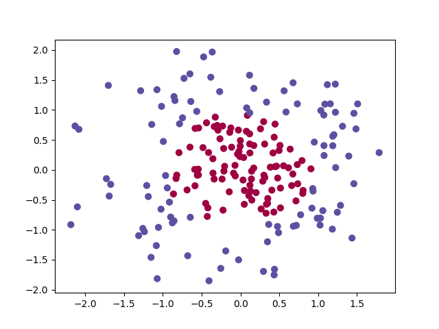
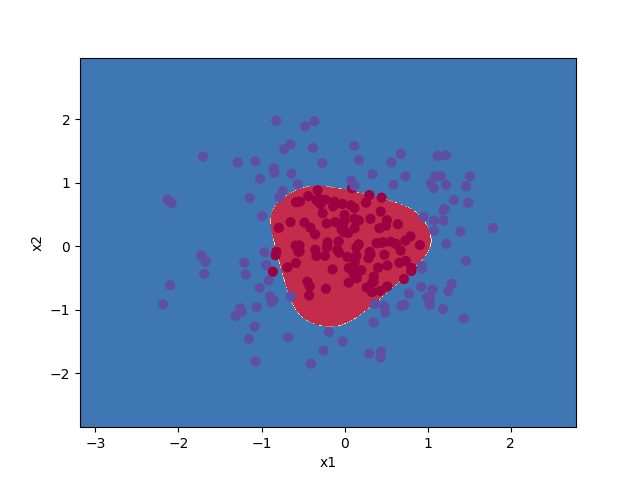

# Neural-Network-Numpy
Simple MLP in Python using Numpy. The network is used to classify 2D data in two classes.

### Input data

### Neural-Network 2-4-1
**Accuracy = 0.965**

### Logistic Regression

Comparison with a linear model, the Logistic Regression model from `scikit-learn`.

**Accuracy = 0.693**

